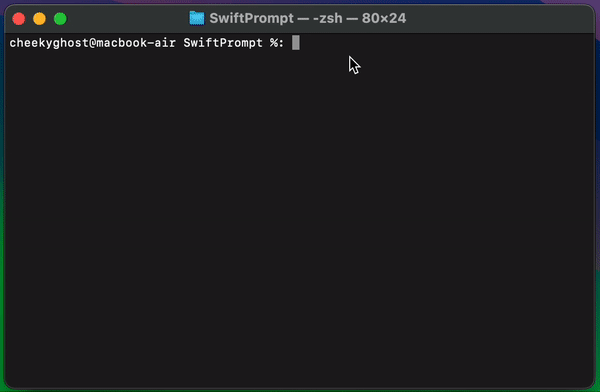

# SwiftPrompt

Convenience methods to present text input and option picker prompts in a swift CLI.

## Screenshots




## Usage

#### Prompt Groups:

`SwiftPrompt` allows individual usage of its utilities, however, it is best to think of your prompts in "Groups" as that is where `SwiftPrompt` draws more visually pleasing terminal output:

<image here>

For example, if you are getting a user to sign up to a service named "Fruits" you can present a group of input prompts that draws under a common header:

```swift
import SwiftPrompt

Prompt.startPromptGroup(title: "Sign Up to Fruits:")

// present prompts

// Write general update to group
Prompt.writeGroupUpdate(title: "Registering account...")

// Close out the group and write outcome
Prompt.endPromptGroup(title: "Account Registered")
```


#### Text Prompt:
To ask for standard text input you can use the `Prompt.textInput`: 

```swift
let emailAddress = Prompt.textInput(
    question: "What is your email address?",
    placeholder: "This input will have not-empty validation",
    isSecureEntry: false,
    validator: {
        // no validation
        return .valid
    }
)
```

you can also customize the validation logic as needed, for example if you wanted to ensure the input is not empty:

```swift
let emailAddress = Prompt.textInput(
    question: "What is your email address?",
    placeholder: "This input will have not-empty validation",
    isSecureEntry: false,
    validator: {
        // Ensure input is not empty
        if !$0.trimmingCharacters(in: .whitespacesAndNewlines).isEmpty {
            return .valid
        } else {
            return .invalid(message: "Please enter something")
        }
    }
)
```

you can also set the `isSecureEntry` to `true` if you want the input to be masked to a `◆` symbol:

```swift
// Ask for password
let password = Prompt.textInput(
    question: "Enter a password:",
    placeholder: "Enter something secure with at least 8 characters",
    isSecureEntry: true,
    validator: {
        if $0.trimmingCharacters(in: .whitespacesAndNewlines).count >= 8 {
            return .valid
        } else {
            return .invalid(message: "Passwords should be at least 8 characters long")
        }
    }
)
```

#### Options Prompt:
Options prompts will display a list of `PromptOption<Type>` to the user and let them use the up, down, and enter keys to select on of the displayed items.

While options must result in the same value type, you can customize the display title that will be displayed:

```swift
let appTypes: [PromptOption<String>] = [
    .init(title: "SwiftUI", value: "swift-ui"),
    .init(title: "UIKit", value: "ui-kit")
]

// Present prompt
let option = Prompt.selectOption(
    question: "Select your tech stack",
    options: appTypes
)

print(option) // prints `swift-ui` or `ui-kit` depending on selection
```

This lets you also use custom types or enums etc, for example selecting your favourite fruit from an enum:

```swift
// Available Fruits
enum Fruit: CaseIterable {
    case apple
    case banana
    case orange
    case tomato

    var title: String {
        switch self {
        case .apple:
            return "🍎 Apple"
        case .banana:
            return "🍌 Banana"
        case .orange:
            return "🍊 Orange"
        case .tomato:
            return "🍅 Tomato"
        }
    }

    // Convenience getter for the `Option<Type>` instance the prompt will use
    var option: PromptOption<Fruit> {
        return .init(title: title, value: self)
    }
}

// Ask for favourite fruit selection

let selectedFruit = Prompt.selectOption(
    question: "Select your favourite fruit",
    options: Fruit.allCases.map(\.option)
)

print(selectedFruit) // prints the selected `Fruit` enum
```


## Installation

### Swift Package Manager

Add the following to your `Package.swift` file:

```swift
let package = Package(
    // name, platforms, products, etc.
    dependencies: [
        // ...
        .package(url: "https://github.com/CheekyGhost-Labs/SwiftPrompt.git", from: "1.0.0"),
    ],
    .product(name: "SwiftPrompt", package: "SwiftPrompt")
    targets: [
        .target(
            name: "YourTarget",
            dependencies: [
                .product(name: "SwiftPrompt", package: "SwiftPrompt")
            ]
        )
        // ...
    ]
)
```

## Testing

I am looking at some testing approaches for this. Due to the nature of the utility however, I am doing a lot of manual testing to enable usage of the library. Watch this space as a unit testing approach will be added in the near future.

## Shout Outs

This utility was heavily inspired by an in-progress port of `Clack` named `swift-clack`. That repo can be found here:

- [polpielladev - Swift Clack](https://github.com/polpielladev/clack-swift/releases)
- [polpielladev - Github Profile](https://github.com/polpielladev)

The original clack library (in JS land) can be found here:

- [natemoo-re - Clack](https://github.com/natemoo-re/clack)